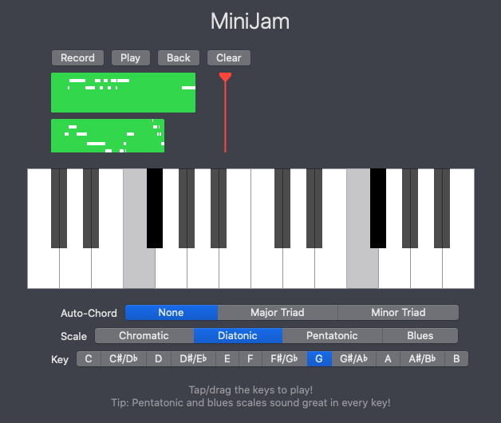

# MiniJam
Mini JAM is a tiny DAW written as a Swift playground.

## Description

The "MiniJam" playground is a tiny Digital Audio Workstation, inspired by GarageBand. It provides a virtual piano keyboard, a multi-track recorder and comes with a variety of different scales, keys and chords to ease the creation of a melody. It focuses on an intuitive, minimalistic interface to provide a simple, fun experience for exploring new musical ideas.

The project is built using SwiftUI, Combine and AVFoundation for audio synthesis and follows the Model-View paradigm. Since SwiftUI provides a powerful, cross-platform declarative UI toolkit, the app can be ported to iOS, tvOS and other Apple platforms with minimal effort.
